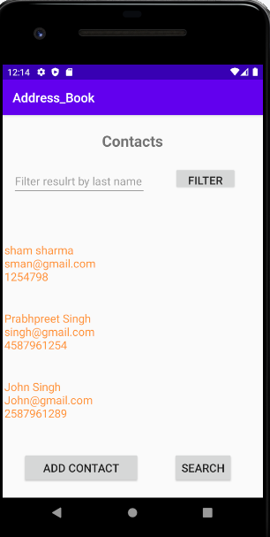
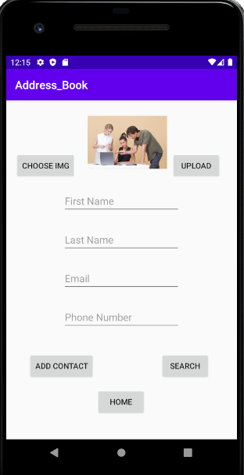
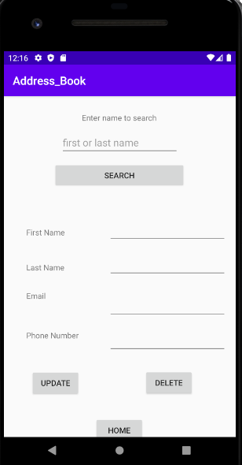

# Address-Book-App

The App is made in Android Studio using Java.

Follow the steps to run it on your computer 

Install Android studio latest version 

Download the project from github 

Open the Project in Android Studio 

If Android Studio ask to install plugins then do so and it will rebuild the gradle 

Set up an emulator with the Android Studio or use a Android Device 

The App Should open up 

Features in The App

The app using cloud firebase realtime database for saving the data and google cloud storage for images.

The Home page Shows the contacts that already stored in the cloud.
We could filter the contacts by last name (More funtionality for filter could be added in the project).
If we press the Add contact button it takes us to different activity where we could add the contacts to cloud.
Search button takes us to the search activity

Add Contact Activity

Allows to add new record and also has the email and phone number validations.
we could choose and upload an image from our device (I was not able to store the images accordinly as per the contacts so that needs to be fixed. It is about the time limit and more practice).

Search Activity

We could search by person's first or last name
once the information is delivered from the cloud, we could the update it as and press the upload button to do the changes.
Delete button allows us to delete a contact. It deletes uniquely as phone number as the primary key.

UI:
The UI was not given much time. But working Functionality was first prefered
